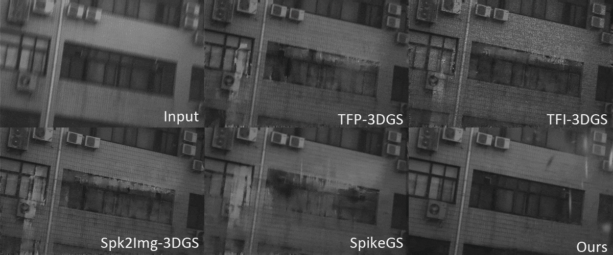

<h2 align="center"> 
  <a href="https://arxiv.org/abs/2411.10504">USP-Gaussian: Unifying Spike-based Image Reconstruction, Pose Correction and Gaussian Splatting</a>
</h2>
<h5 align="center"> 
If you like our project, please give us a star ⭐ on GitHub.  </h5>
<h5 align="center">

&#160;

</h5>

  

## 📕 Abstract
> We propose a synergistic optimization framework USP-Gaussian, that unifies spike-based image reconstruction, pose correction, and Gaussian splatting into an end-to-end framework. Leveraging the multi-view consistency afforded by 3DGS and the motion capture capability of the spike camera, our framework enables a joint iterative optimization that seamlessly integrates information between the spike-to-image network and 3DGS. Experiments on synthetic datasets with accurate poses demonstrate that our method surpasses previous approaches by effectively eliminating cascading errors. Moreover, we integrate pose optimization to achieve robust 3D reconstruction in real-world scenarios with inaccurate initial poses, outperforming alternative methods by effectively reducing noise and preserving fine texture details.

## 👀 Visual Comparisons

<strong>Novel-view synthesis comparison on the real-world dataset.</strong>

<strong>Jointly optimized 3DGS and Recon-Net reconstruction on the synthetic dataset.</strong>

## 🗓️ TODO
- [ ] Release the synthetic/real-world dataset.
- [ ] Release the scripts for processing synthetic and real-world dataset.
- [ ] Release the training and testing code.
- [ ] Release the pretrained model.
- [ ] Release the project page.

All parts will be released before 24.11.30.

## 🙇‍ Acknowledgment
Our code is implemented based on the [BAD-Gaussian](https://github.com/WU-CVGL/BAD-Gaussians) and thanks for Lingzhe Zhao for his detailed help.
